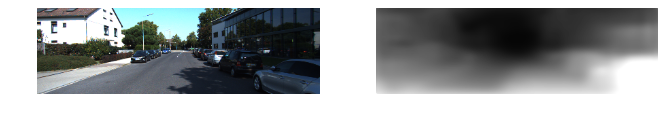
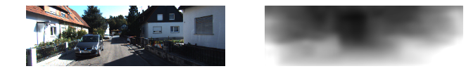

# SfMLearner Chainer version
This codebase implements the system described in the paper:

Unsupervised Learning of Depth and Ego-Motion from Video [link](https://people.eecs.berkeley.edu/~tinghuiz/projects/SfMLearner/)  
See the [project webpage](https://people.eecs.berkeley.edu/~tinghuiz/projects/SfMLearner/) for more details.

TF code: https://github.com/tinghuiz/SfMLearner

  
  
  

## Preparing training data
In order to train the model using the provided code, the data needs to be formatted in a certain manner.

### Depth
For [KiTTI](http://www.cvlibs.net/datasets/kitti/raw_data.php), first download the dataset using this [script](http://www.cvlibs.net/download.php?file=raw_data_downloader.zip) provided on the official website, and then run the following command
```bash
python data/prepare_train_data.py /path/to/KITTI_raw --dataset-format kitti_raw --static-frames ./data/static_frames.txt  --dump-root /path/to/KITTI_formatted --height 128 --width 416 --num-threads 8
```

### Odometry
This script generates only training data.  
Remove '2011_09_26_drive_0067' sequence because there is no data at kitti server.
```bash
python data/prepare_train_data.py /path/to/KITTI_raw --dataset-format kitti_odom --static-frames ./data/static_frames.txt  --dump-root /path/to/KITTI_formatted --height 128 --width 416 --num-threads 8
```

## Training using KiTTI Raw Dataset
Once the data are formatted following the above instructions, you should be able to train the model by running the following command

### Depth
```bash
python3 train.py experiments/sfm_learner_v1.yml
```

### Odometry
```bash
python3 train.py experiments/sfm_learner_v1_odom.yml
```

## Evaluation using KiTTI Raw Dataset
If you finish training models using above scripts, you should be able to evaluate your trained model.

### Depth
You can obtain the single-view depth predictions on the KITTI eigen test split formatted properly for evaluation by running.  
You could download pretrained model from [here](https://www.dropbox.com/s/i42vo9u0ns4ibcp/exp02smooth01.npz)
```bash
python evaluate.py experiments/sfm_learner_v1_eval.yml
```

### Odometry
You can obtain the 5-snipped odometry predictions on the KITTI odometry dataset. This scripts use kitti raw dataset directly.
```bash
python evaluate.py experiments/sfm_learner_v1_odom_eval.yml --eval_mode odom
```

## Inference using KiTTI Raw Dataset
### Depth
You could download pretrained model from [here](https://www.dropbox.com/s/i42vo9u0ns4ibcp/exp02smooth01.npz)
```bash
# For kitti formatted dataset
python inference.py experiments/sfm_learner_v1_test.yml
# For a image
python inference.py experiments/sfm_learner_v1_test.yml --img_path /path/to/img --save 1 --width 416 --height 128
```

### odometry
```bash
# TODO
# For kitti formatted dataset
python inference.py experiments/sfm_learner_v1_odom_test.yml
```
